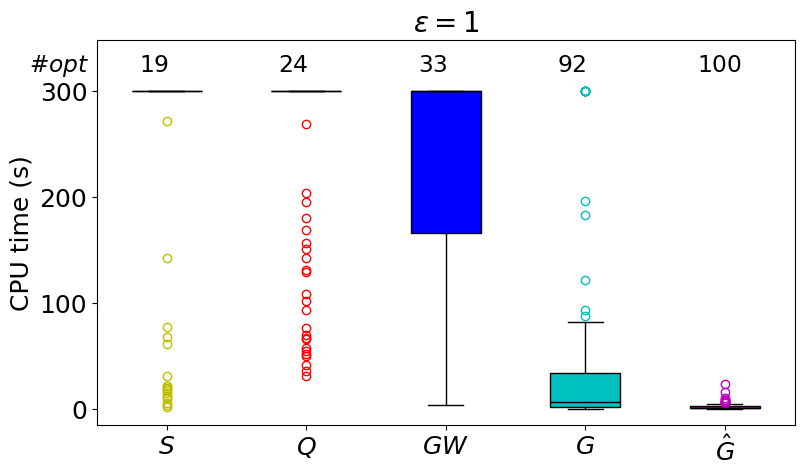
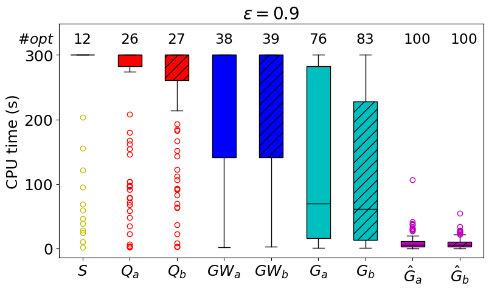
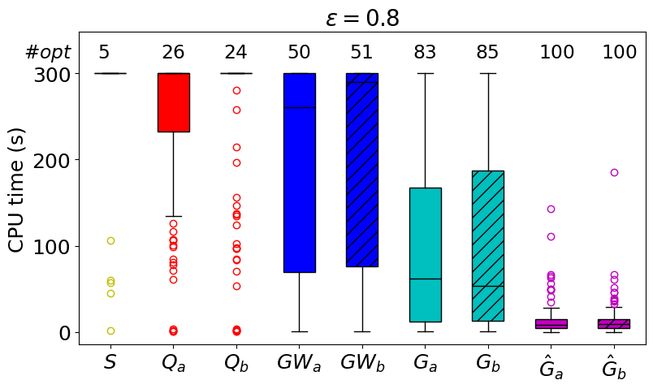
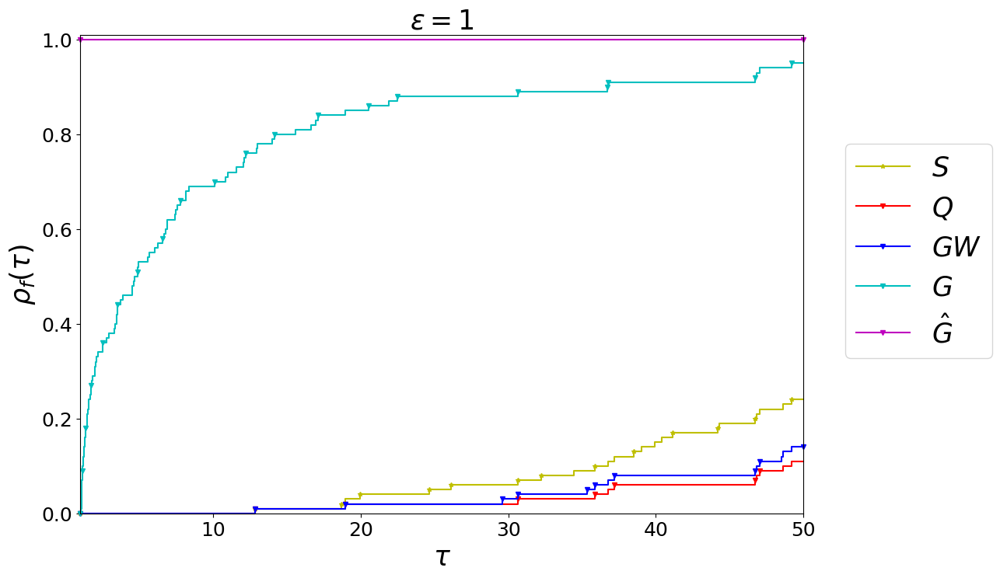
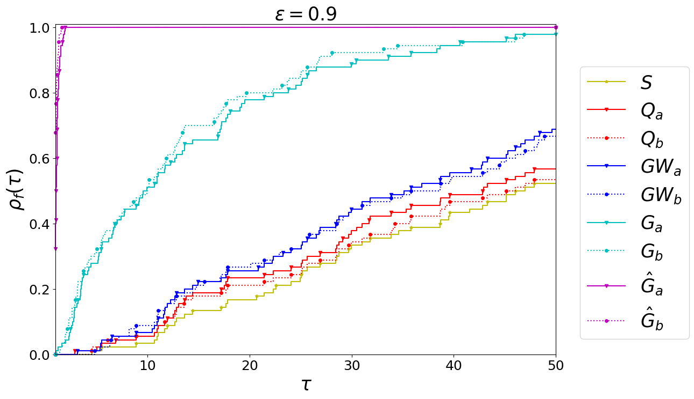
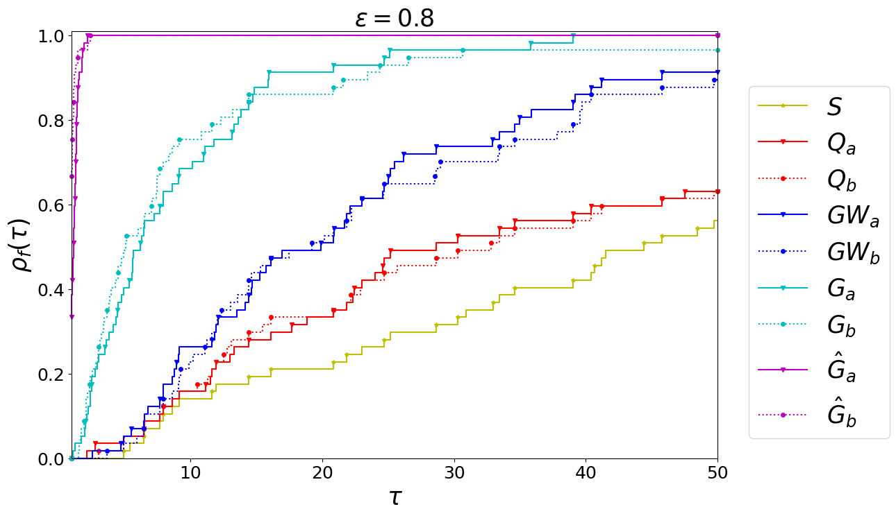
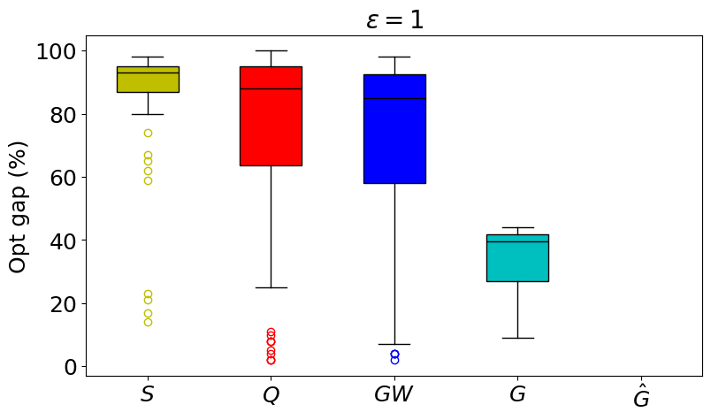
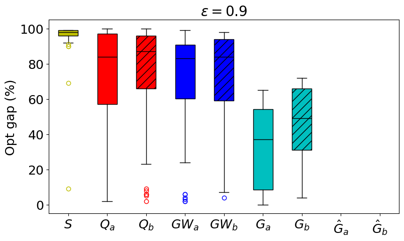
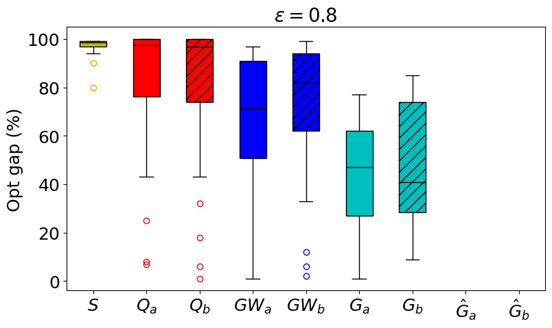

# Train Single-Routing Selection Problem (TSRSP) — Results Repository

All results reported in this section—**CPU time distributions**, **performance profiles**, and **optimality gap distributions**—refer exclusively to the instances derived from the **Rouen railway network**.  
These instances are grouped by compatibility graph density, with values of $\varepsilon \in${1, 0.9, 0.8}.

All experiments were run with a maximum solution time of **300 seconds** per instance.

## 🕒 CPU Time Results for TSRSP Formulations

### 📈 CPU Time Distributions

The following box plots show the distribution of CPU times (in seconds) for all tested formulations, grouped by edge density levels of the compatibility graph.
Each plot includes the median, interquartile range, and potential outliers, as well as the number of optimally solved instances ("\#opt") out of 100 per group.

  
  
  

**Observations:**
- The best performance is achieved by formulations $\hat{G}$, $\hat{G}_a$, and $\hat{G}_b$, with consistently low CPU times and narrow distributions.
- Formulation $G$ is also efficient for $\varepsilon = 1$, but its variants degrade in performance with sparser graphs.
- Formulations $GW$, $Q$, and $S$ perform poorly, with CPU times often approaching the 300-second limit.
 

### 📊 Performance Profiles

Following [Dolan and Moré (2002)](https://link.springer.com/article/10.1007/s101070100263), the **performance profile** $\rho_f(\tau)$ for a formulation $f$ measures how close its solution times are to the best solver across instances.

Let $t_{i,f}$ be the solution time for instance $i$ with formulation $f$, and $\mathcal{F}$ be the set of all tested formulations:

$$
r_{i,f} = \frac{t_{i,f}}{\min_{f' \in \mathcal{F}} t_{i,f'}} \quad,\quad \rho_f(\tau) = \frac{|\{ i \in \mathcal{I} : r_{i,f} \leq \tau \}|}{|\mathcal{I}|}
$$

The following plots show $\rho_f(\tau)$ for each formulation and edge density level.

  
  
  

**Observations:**
- Formulations $\hat{G}$, $\hat{G}_a$, and $\hat{G}_b$ dominate across all $\tau$.
- $G$ is competitive for dense graphs but degrades with sparsity.
- $GW$, $Q$, and $S$ exhibit poor performance and solve fewer instances in acceptable time frames.
- The impact of using the **non-edge constraints** over **anti-neighborhood constraints** is limited.
 

## 📉 Optimality Gap for TSRSP Formulations

The following figure presents box plots of the **percentage optimality gap** (*Opt gap (%)*), computed as the percentage difference between the best feasible solution found and the best lower bound obtained within the time limit by all tested formulations, grouped by edge density levels of the compatibility graph.

These values are reported **only for instances that were not solved to proven optimality**. Each plot includes the median, interquartile range, and potential outliers.
This analysis complements the CPU time plots by evaluating **solution quality** when optimality is not reached.

  
  
  

**Observations:**
- Formulations in the $G$ family not only solve more instances to optimality but also yield **smaller gaps** on unsolved instances.
- In contrast, $S$, $GW$, and $Q$ produce a higher number of suboptimal solutions, often with **larger optimality gaps**.
- At $\varepsilon = 1$, most unsolved instances under $G$ show gaps below 40%, while $GW$ and $Q$ often exceed 60–100%.
- The $S$ formulation consistently shows the **largest median gaps** across densities.
- As edge density decreases ($\varepsilon = 0.9$ and $0.8$), both $G_a$ and $G_b$ exhibit **larger upper quartiles**, suggesting that sparse compatibility graphs are harder to solve optimally.
- Between the two, $G_a$ outperforms $G_b$, confirming the theoretical advantage of **non-edge constraints** over **anti-neighborhood constraints**.
- Interestingly, the **median and first quartile** of $GW$, especially $GW_a$, **decrease** as edge density drops, reflecting the smaller model size in sparser instances.
 
