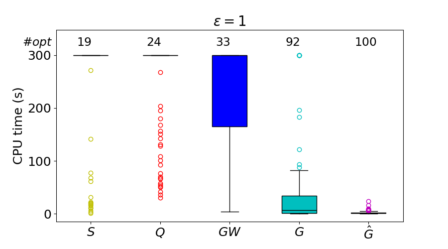
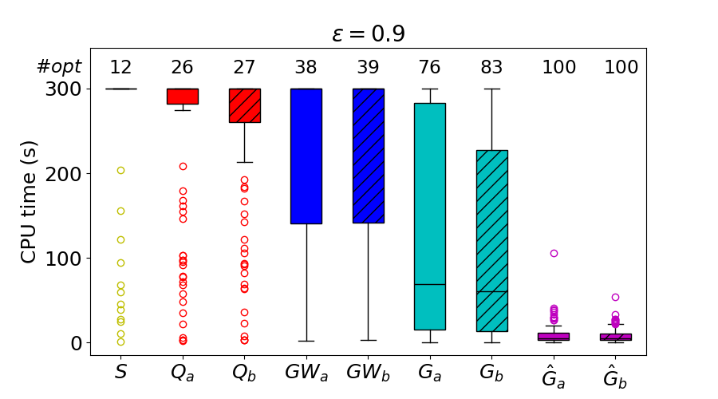
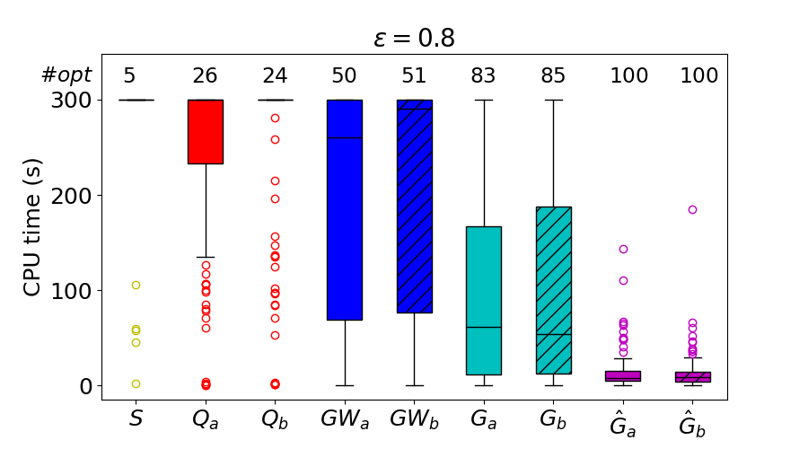
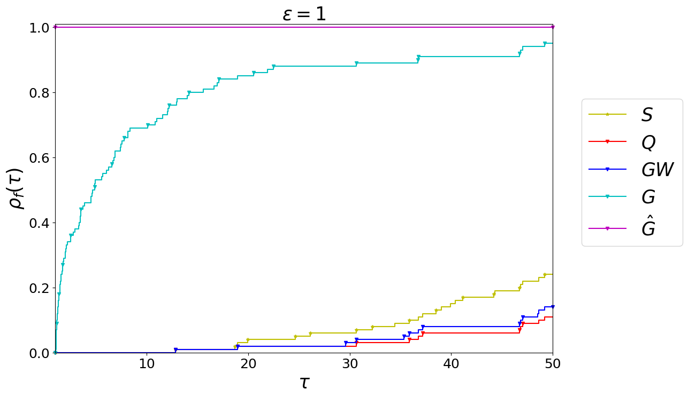
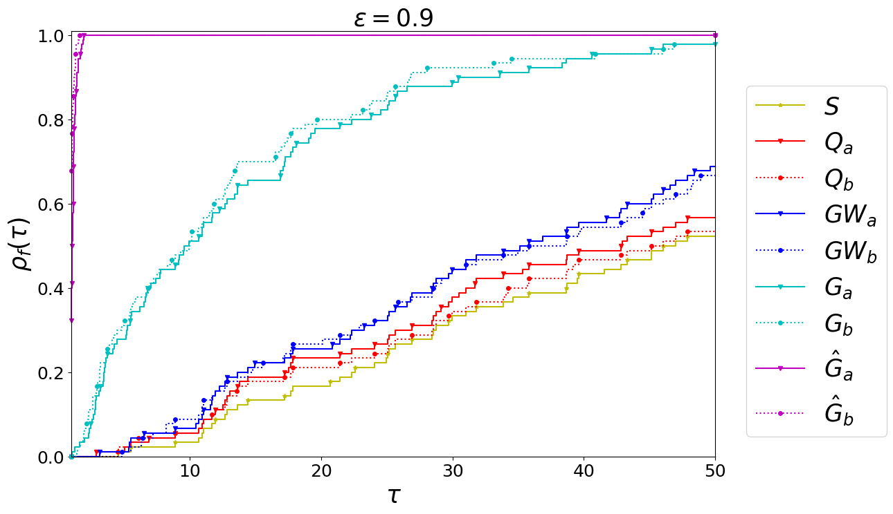
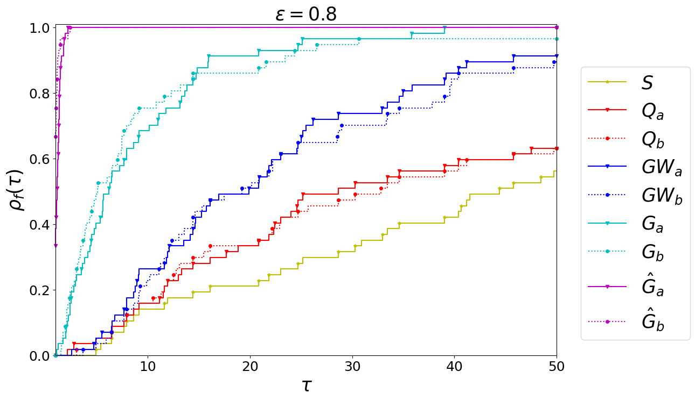

# Train Single-Routing Selection Problem (TSRSP) — Results Repository

## 📊 Instance Statistics

Complete statistics for the **Rouen** and **Lille** railway networks are available in the following files:
- [`Rouen.pdf`](./fig_and_tab/Rouen.pdf)
- [`Lille.pdf`](./fig_and_tab/Lille.pdf)

Key statistics include:

- Number of trains ($|\mathcal{K}|$);
- Number of routes ($|\mathcal{V}|$);
- Number of compatibility edges ($|\mathcal{E}|$);
- Optimal objective value (`Obj`).
 

## 🕒 CPU Time Results for TSRSP Formulations

## ⏳ Time Limit

All experiments were run with a maximum solution time of **300 seconds** per instance.

### 📈 CPU Time Distributions

The following box plots show the distribution of CPU times (in seconds) for all tested formulations, grouped by edge density levels of the compatibility graph:  
- $\varepsilon = 1.0$  
- $\varepsilon = 0.9$  
- $\varepsilon = 0.8$

Each plot includes the median, interquartile range, and potential outliers, as well as the number of optimally solved instances (``\#opt'') out of 100 per group.

**Figures:**
- `Time_Rouen0.png` – $\varepsilon = 1.0$
- `Time_Rouen10.png` – $\varepsilon = 0.9$
- `Time_Rouen20.png` – $\varepsilon = 0.8$

  
  
  

**Observations:**
- The best performance is achieved by formulations $\hat{G}$, $\hat{G}_a$, and $\hat{G}_b$, with consistently low CPU times and narrow distributions.
- Formulation $G$ is also efficient for $\varepsilon = 1$, but its variants degrade in performance with sparser graphs.
- Formulations $GW$, $Q$, and $S$ perform poorly, with CPU times often approaching the 300-second limit.
 

### 📊 Performance Profiles

Following [Dolan and Moré (2002)](https://epubs.siam.org/doi/10.1137/S1064827502417021), the **performance profile** $\rho_f(\tau)$ for a formulation $f$ measures how close its solution times are to the best solver across instances.

Let $t_{i,f}$ be the solution time for instance $i$ with formulation $f$, and $\mathcal{F}$ be the set of all tested formulations:

$$
r_{i,f} = \frac{t_{i,f}}{\min_{f' \in \mathcal{F}} t_{i,f'}} \quad,\quad \rho_f(\tau) = \frac{|\{ i \in \mathcal{I} : r_{i,f} \leq \tau \}|}{|\mathcal{I}|}
$$

The following plots show $\rho_f(\tau)$ for each formulation and edge density level.

  
  
  

**Highlights:**
- Formulations $\hat{G}$, $\hat{G}_a$, and $\hat{G}_b$ dominate across all $\tau$.
- $G$ is competitive for dense graphs but degrades with sparsity.
- $GW$, $Q$, and $S$ exhibit poor performance and solve fewer instances in acceptable time frames.
 
